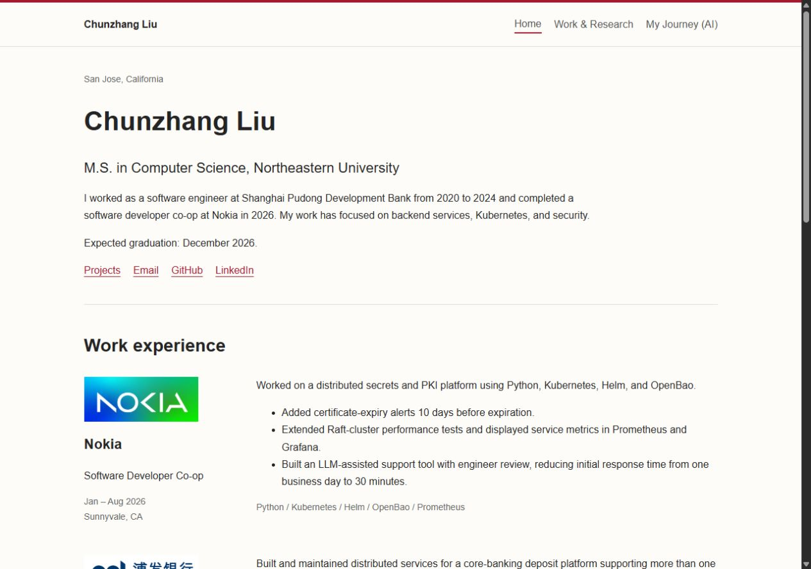

# Chunzhang Liu — Personal Homepage

- Author: Chunzhang Liu
- Website: https://prostream.github.io/personal-homepage/
- Course link: TO ADD
- Goal: introduce my education, experience and projects for job searching and networking.
- [Design document and mockups](docs/design.md)
- License: MIT



## Pages

- `index.html`: introduction, Nokia and SPDB experience, career journey, contact.
- `work.html`: DroneRanger, Climate Shield, LLM inference, publication and patent.
- `ai.html`: My Journey (AI), a five-chapter personal story with a sunrise ocean and three native 3D models.

## Run and edit

This is a static website with native HTML, CSS and JavaScript. There is no build step or frontend library.

With Node.js installed, run:

```sh
npm run dev
```

Open http://127.0.0.1:4173. No `npm install` is needed to view the site. The small script in `scripts/` is only a local preview server; GitHub Pages hosts the actual website.

Edit the HTML files to change text, `css/styles.css` to change the appearance, and `js/main.js` to change the career journey or project filters. Images go in `images/`.

Prettier is optional for editing. To format the files, run `npm install` and then `npm run format`. This creates a local `node_modules` folder containing development tools; the website does not use it, and Git ignores it.

Push changes to `codex/personal-homepage` to update GitHub Pages.

## Assignment notes

ESLint configuration has been removed in this simplified version, so that rubric item is not currently met. The course link, narrated demo video and course code review still need to be completed.

## Use of generative AI

I used OpenAI Codex to help develop this website and plan a redesign of its AI page. The session identifies the model family as GPT-6; the exact model snapshot/version is not available. AI assistance has also been used on the other pages, styling, JavaScript, and documentation.

For the AI-page redesign, I described the effect I wanted: a sunrise over the ocean, readable text on the left, and three 3D objects on the right that relate to my experiences. I provided the story outline, from an early interest in computers through Information Security, banking backend work, studying abroad, Nokia, learning about AI, and future possibilities.

Instead of asking the AI to immediately write the page, I asked it to first prepare an English Markdown proposal. [The AI-page plan](docs/ai-page-plan.md) explains the visual design, draft text, object choices, interactions, technical approach, planned file changes, and proposed implementation prompt. This lets me understand what would be built and check whether it matches my requirements before approving implementation. I reviewed the proposal and authorized implementation with “可以，开始实现吧” (“Yes, start implementing”). The approved plan then guided the implementation. This approval covered the plan; it does not imply that I have reviewed every detail of the finished page.

The implemented page uses native WebGL with no external API calls, model downloads, or new runtime dependencies. AI generated the ocean shader, three composed models, page styling, and chapter/motion controls in `ai.html`, `css/ai.css`, and `js/ai.js`. The computer is reused for the first two chapters, the globe represents studying abroad, and the cloud/server model is reused for the final two chapters. I provided the personal facts and approved the English story draft. Browser checks covered the chapter mappings, keyboard controls, pause/resume, desktop/mobile layouts, reduced-motion initialization, and readable fallbacks without JavaScript or WebGL. Final visual review by me is still welcome.
