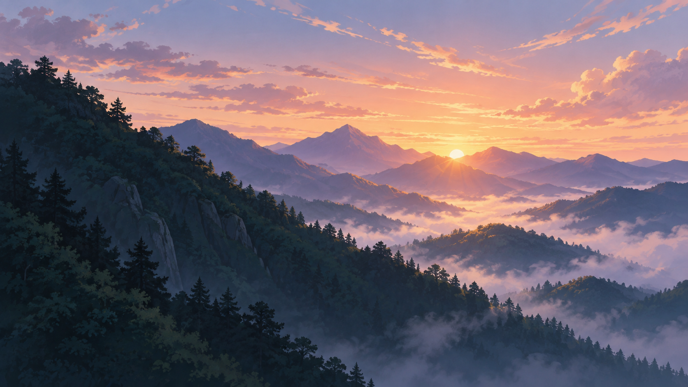

# AI Page Revision: An Animated Landscape and Interactive Objects

**Status: Approved by the user with “ok 实现吧” (“OK, implement it”) and implemented.**

The user reviewed the first ocean version and asked for a better visual result, a Japanese animation-inspired mountain sunrise, and 3D objects that visibly twist and wiggle.

**Latest direction:** The user provided [Sunseto](https://sunset.mengto.here.now/) as a reference and clarified that the background subject is flexible, but it should be animated. After reviewing the updated proposal, the user authorized implementation. The existing generated mountain image was selected as the local landscape, with animated mist and drifting petals added in code.



This preview was generated with the built-in image-generation tool using the prompt below. The original is saved as `docs/previews/mountain-sunrise-v2.png`; the website loads a copy at `images/mountain-sunrise-v2.png`. This still image shows only the landscape, not the implemented models or animation.

## Visual direction

Use a full-screen scenic background with continuous ambient movement and well-lit 3D objects in front of it. The existing five English story paragraphs and three object choices remain appropriate. A mountain sunrise can still work, but the particular landscape is no longer a requirement.

The reference was inspected in a browser. Its hero combines a warm illustrated landscape, drifting petals, a large cream serif heading, a translucent navigation bar, and a solar-panel object that changes orientation when dragged. These are observed visual and interaction features; this document does not claim to have audited the site's source code or rendering library.

The implemented design borrows the composition, coherent lighting, and responsive object movement. The approved direction uses restrained springy tilt and drag rotation instead of the earlier proposal's strong jelly-like distortion. The reference site's assets and code were not copied.

- **Background:** a warm landscape with visibly drifting mist/clouds and a sparse layer of petals or light particles suited to the scene. The landscape may remain a static image, but its atmospheric layers should visibly move while the page is idle.
- **Objects:** rounded edges, smooth shading, warm highlights, and cool shadows that match the scene. Preserve each object's recognizable shape.
- **Composition:** text on the left, a larger object on the right, with enough separation that the two never overlap. Keep the brightest area away from the reading panel.
- **Text:** a larger cream serif heading and simple body text, with more breathing room. Use a dark left-side gradient and a restrained backing behind the paragraph where needed, avoiding a visually heavy card. Check body-text contrast at least 4.5:1 over the brightest animation state. The text itself should not move or distort.
- **Small screens:** text first and the object beneath it; crop the landscape without depending on any single feature remaining visible.

A moving 3D object alone does not satisfy the new background requirement. Keep the atmospheric animation apparent but slow, with very few particles near the paragraph. A moving camera or a video download is unnecessary for this effect.

## Three models and their motion

| Story chapters                                                       | Model                                                         | Proposed movement                                                                                                                                                                                    |
| -------------------------------------------------------------------- | ------------------------------------------------------------- | ---------------------------------------------------------------------------------------------------------------------------------------------------------------------------------------------------- |
| 0–1: childhood curiosity, Information Security, banking backend work | A rounded retro computer with a screen and keyboard           | A gentle idle tilt, pointer-following orientation, and drag rotation. On release, settle with a small spring-like rebound. Keep the screen and keyboard aligned as one composed object.              |
| 2: leaving a stable job to study abroad                              | A smooth globe with a travel arc                              | A slow turn and direct drag rotation with gentle settling. Keep the sphere round. The travel marker follows the arc, which follows the globe's overall pose.                                         |
| 3–4: Nokia, cloud/security, AI, and the future                       | A rounded cloud above three small servers and connected nodes | Cloud lobes bob with slightly different timing. Servers lean and recover in sequence. Connection lines follow their nodes. Chapter 4 gently opens the node arrangement without adding another model. |

Use a roughly 4–6 second idle motion cycle as a starting point, with a small tilt and bob. Dragging should produce a clearly larger orientation change. Use restrained spring easing on release, avoiding endless spinning or exaggerated bending. The cloud can have softer internal movement than the computer and globe.

On devices with a precise pointer, lean slightly toward the pointer within the object area. On touch, allow horizontal dragging while preserving ordinary vertical page scrolling. Chapter buttons remain usable without dragging or hover. The scene should already feel animated before any interaction.

## Implementation approach

Keep the existing native HTML, CSS, JavaScript ES modules, and WebGL approach. No new framework, npm dependency, or backend is proposed.

1. Use the existing generated landscape or another suitable local image under `images/` after review. Visitors do not call an image-generation API.
2. Remove the procedural ocean shader. Place slow CSS mist layers and a small Canvas 2D particle layer above the background, with a transparent WebGL canvas for the foreground model. Decorative layers must not capture pointer events.
3. Replace coarse box/sphere construction with rounded edges and smooth sphere normals. Add warm directional light and a restrained rim highlight.
4. Use native pointer events for constrained drag rotation and a small spring calculation for settling. Avoid a deformation system unless a later visual review shows it is needed.
5. Move related parts together so the screen, keyboard, orbit, and cables stay attached. Use correctly transformed normals for lighting.
6. Keep one active model, the fixed camera, capped resolution, and the existing pause-when-hidden behavior.

The extra polish comes from coordinated composition, lighting, and interaction. Removing the ocean shader simplifies one part, while atmospheric layers and drag controls add another; a precise line-count reduction is not promised.

Keep the Pause motion control and reduced-motion support. Pausing must stop the atmosphere, particles, idle motion, and pointer-driven movement. Chapter selection must continue working. Reduced-motion mode starts with a static scene. With JavaScript or WebGL unavailable, the landscape and all five HTML story paragraphs should remain readable.

## File changes after approval

| File             | Change                                                                                                          |
| ---------------- | --------------------------------------------------------------------------------------------------------------- |
| `images/`        | Add the selected background as a local asset; the scene and filename are not final.                             |
| `css/ai.css`     | Apply the landscape, mist animation, text contrast layers, and revised desktop/mobile spacing.                  |
| `js/ai.js`       | Remove the ocean shader; revise geometry, lighting, particles, idle motion, drag rotation, and spring settling. |
| `ai.html`        | Update scene labels and background attribution while preserving the story and native controls.                  |
| `docs/design.md` | Record the new visual design after it is implemented.                                                           |
| `README.md`      | Record this prompt iteration and, later, the actual implementation and verification results.                    |

The shared homepage/work styles and their content do not need changes for this revision.

## Background-generation prompt

Tool: built-in image generation. This is the prompt used for the earlier mountain illustration preview, not the latest implementation prompt or a screenshot of the website.

```text
Use case: stylized-concept
Asset type: background-only preview for a personal journey website, wide 16:9 landscape.
Primary request: a beautiful Japanese animation-inspired mountain sunrise, painted as an atmospheric 2D animation background.
Scene: layered forested mountain ridges frame a quiet valley filled with soft morning mist. The sun is just rising between distant peaks, slightly right of center. Wisps of cloud cross a pale peach and lavender sky. Near mountains are deep blue-green; distant ridges fade into lavender and warm gold. Hand-painted brush texture, graceful silhouettes, rich but restrained color, luminous natural sunrise.
Composition: full-bleed panoramic landscape. The left 40 percent is a calmer, darker foreground hillside with low detail, suitable for a readable text panel later. The right half has open, softly lit sky and mist above lower ridges, leaving room for a separate interactive 3D object. Put the sun near the central valley, not at the far right. Keep a scenic composition that also works when cropped on mobile.
Mood: hopeful, peaceful, cinematic, warm early light against cool mountain shadows.
Constraints: background illustration only. No interface, text, letters, logos, watermarks, people, buildings, torii, computers, globes, or floating 3D objects. Do not bake in a text panel. No ocean. Avoid photorealism, neon colors, and busy foreground foliage.
```

## Proposed implementation prompt

> After the user approves implementation, revise the AI journey page using this plan and https://sunset.mengto.here.now/ as a visual reference. Borrow its scenic composition, warm light, cream typography, ambient movement, and draggable object interaction while keeping our personal story and original assets. The exact landscape is flexible. Preserve the five existing English paragraphs and the chapter mapping: computer for 0–1, globe for 2, cloud/server model for 3–4.
>
> Make the background visibly animated at idle using slow mist/cloud layers and sparse drifting particles. Make the objects rounded and smoothly shaded with matching warm lighting, gentle idle movement, pointer-following tilt, drag rotation, and restrained spring settling. Keep recognizable shapes and attached components. Avoid exaggerated jelly-like distortion.
>
> Use spacious left-text/right-object composition. Keep text stationary and readable with a dark gradient and localized backing as needed. Preserve native chapter buttons, visible keyboard focus, pause/resume, reduced-motion support, and readable fallbacks. Pausing stops all decorative motion. Touch dragging must not block vertical scrolling. Use native HTML/CSS/ES-module JavaScript, Canvas 2D, and WebGL, with local assets and no new runtime dependency or external API request.
>
> Verify desktop/mobile framing, contrast across animation states, chapter/model mapping, background motion without input, drag and release, touch scrolling, pause, reduced motion, and fallback content. Keep changes specific to the AI page. Update documentation to distinguish reference observations, generated assets, implemented behavior, and pending review.

## Implementation and checks

The original implementation proposal and prompts above document the review process. Following approval, `ai.html`, `css/ai.css`, and `js/ai.js` were updated. The generated landscape is local; mist uses CSS, petals use Canvas 2D, and the three models use native WebGL. The scene has smooth normals, rounded box edges, warm lighting, pointer-following tilt, constrained drag rotation, keyboard rotation, and damped spring settling. Five chapters reuse exactly three model designs.

Pause freezes all decorative motion, including mist, particles, and pointer response. Reduced-motion preference initializes the page in that paused state, with an explicit Resume option. Without JavaScript or WebGL, all five story paragraphs remain available.

Browser verification covered all chapter/model mappings, keyboard rotation, mouse dragging and release, pause/resume, chapter selection while paused, simulated reduced-motion preference, and no-JavaScript/no-WebGL fallbacks. Layouts at 320, 390, 768, 1024, and 1440 pixels had no horizontal overflow. Touch interaction uses horizontal pointer dragging with `touch-action: pan-y` to preserve vertical scrolling; a physical touchscreen was not tested. The final HTML passed W3C validation with zero errors and zero warnings; informational messages concern Prettier's void-element trailing slashes.

Main paragraph contrast has a conservative lower bound of 4.83:1 across desktop widths, calculated against an all-white landscape beneath the dark gradient. Small scene labels have their own dark backing. No runtime dependency, backend, or visitor-facing AI API call was added. Shared homepage and work-page styles remain unchanged.
