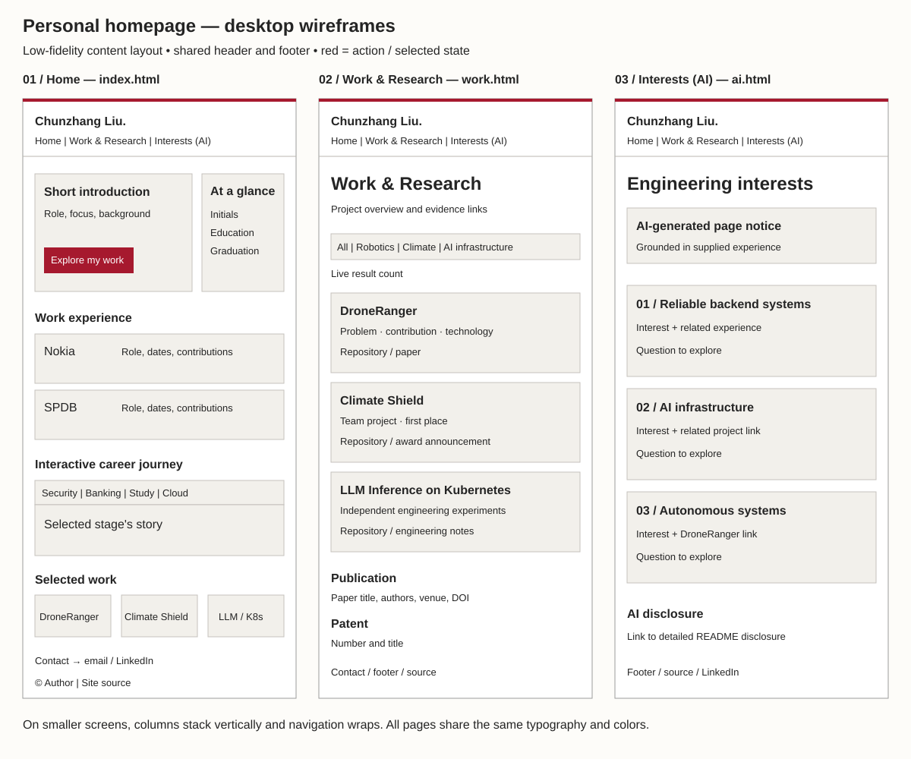
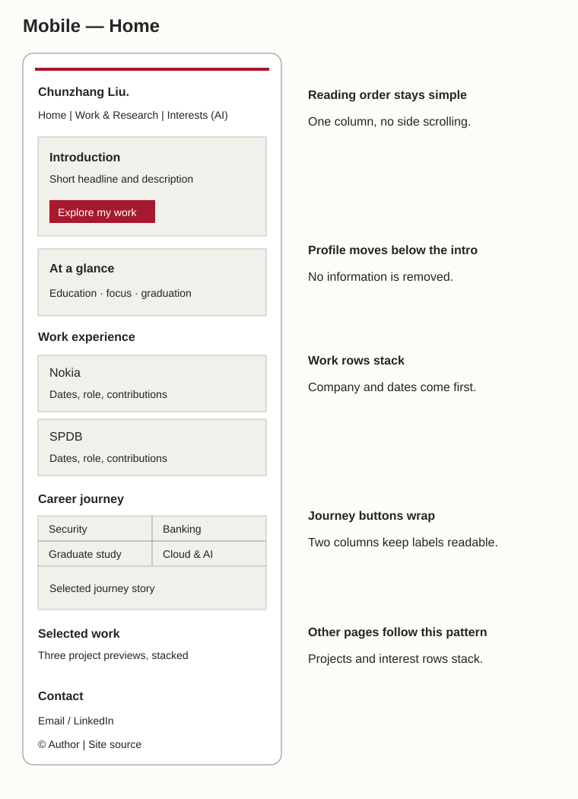

# Project 1 design document

**Author:** Chunzhang Liu

**Project:** Personal homepage

**Date:** September 26, 2026

## 1. Project description

Create a personal homepage that gives visitors a quick, accurate overview of my education, professional experience, projects, publication, and patent. The goal is to support job applications and professional networking. Visitors should be able to understand what I do, find evidence in projects or repositories, and contact me without searching through a long resume.

The primary content is my experience at Nokia and Shanghai Pudong Development Bank, my studies at Northeastern University and Sichuan University, and three selected projects: DroneRanger, Climate Shield, and LLM Inference on Kubernetes.

The implementation uses only HTML5, CSS3, and JavaScript ES modules. Three separate HTML pages are hosted on GitHub Pages. An interactive career journey connects my background to my current interests. The visual style is restrained: warm white, dark text, red accents, simple dividers, and system fonts. Northeastern is identified in the education text; this is a personal site, not an official university website.

### Intended outcomes

- A recruiter can find my current degree, graduation date, two work experiences, projects, and contact details quickly.
- A professor can visit all three pages, try the original JavaScript interactions, and inspect the repository against Project 1 requirements.
- A potential collaborator can open project details and repositories to understand the work.
- A colleague can find my professional links and contact me.

## 2. User personas

These are representative visitor scenarios, not claims about specific people.

| Visitor                          | Situation and goal                                                                 | What the site needs to provide                                                                                                                      |
| -------------------------------- | ---------------------------------------------------------------------------------- | --------------------------------------------------------------------------------------------------------------------------------------------------- |
| Recruiter / HR                   | Opens a link from my application and has limited time to understand my background. | A short introduction, work history, technical experience, graduation date, selected projects, and contact links.                                    |
| Course professor                 | Visits the submitted website to evaluate Project 1.                                | Working page navigation, an original interactive feature, access to the source repository, and clear identification of the third AI-generated page. |
| Classmate                        | Wants to learn about my skills before discussing a team project.                   | Concrete project descriptions, technologies, and repository links.                                                                                  |
| Colleague / professional contact | Follows a shared link to learn more about me and stay in touch.                    | A brief professional introduction, areas of interest, LinkedIn, and email.                                                                          |

## 3. User stories

### Recruiting

As a recruiter opening a link from Chunzhang's application, I want to quickly read his education and work experience so I can decide whether his background matches the role.

**Example path:** Home → introduction and graduation date → Nokia and SPDB → selected project → email or LinkedIn.

### Project 1 review

As the course professor opening Chunzhang's submission, I want to visit each page and try the interactive features so I can check whether the website meets the Project 1 requirements.

**Example path:** Home → click the career-journey buttons → Work & Research → filter projects → Interests (AI) → Site source.

### Teamwork

As a classmate looking for a teammate, I want to read about Chunzhang's projects and the technologies he used so I can see whether we could work together.

**Example path:** Work & Research → choose a topic → read a project → open its repository → contact Chunzhang.

### Networking

As a colleague following a shared link, I want to learn what Chunzhang has worked on and find his contact details so we can stay in touch.

**Example path:** Home → introduction → work history or projects → LinkedIn or email.

## 4. Page structure and design mockups

The following low-fidelity mockups show content placement and navigation. They are intentionally simple so they can be compared directly with the HTML implementation.

### Home — `index.html`

1. Shared header: name and three page links.
2. Introduction, links to work/contact, and a compact education/focus summary.
3. Nokia and SPDB experience.
4. Four-stage education/career journey, with one selected story at a time.
5. Three selected project previews.
6. Contact section and footer with source/LinkedIn links.

### Work & Research — `work.html`

1. Shared header and a short introduction.
2. Native project-filter buttons: All, Robotics, Climate tech, AI infrastructure.
3. Project articles describing the problem, engineering work, technology, and evidence links.
4. DroneRanger publication and the supplied patent number/title.
5. Contact section and shared footer.

### Interests (AI) — `ai.html`

1. Shared header and a visible AI-generation note.
2. Three interest areas connected to the actual experience: backend reliability, AI infrastructure, and autonomous systems.
3. AI disclosure and related project links.

### Layout and accessibility decisions

- Desktop: a maximum-width reading area, two-column introduction and experience rows, and three project previews using Flexbox.
- Mobile: one reading column; navigation wraps and the journey buttons form a two-by-two layout.
- Styling: neutral background, dark body text, red links and active states, light-gray information panels, and no decorative animation.
- Navigation: ordinary links connect separate HTML URLs. IDs are used for anchor targets; classes identify elements for styling and script behavior.
- Interaction: native buttons support keyboard activation, visible focus, and `aria-pressed`. Live regions announce journey/filter updates. A skip link jumps to main content.
- Images: initials monogram with an alternative description, plus a favicon.
- Progressive enhancement: essential content is already in HTML. If JavaScript is unavailable, every journey entry and project remains readable.

## 5. Implementation and evaluation

Content is edited directly in the HTML files. CSS, JavaScript, images, and documentation live in separate folders. JavaScript modules are small and share one entry point. The production site has no backend or runtime dependencies.

Check the result through formatting/lint checks, HTML validation, desktop/mobile browser inspection, navigation, keyboard controls, and both original interactions. Course-specific tasks that cannot be completed by website code alone are tracked in [the submission guide](submission.md).
